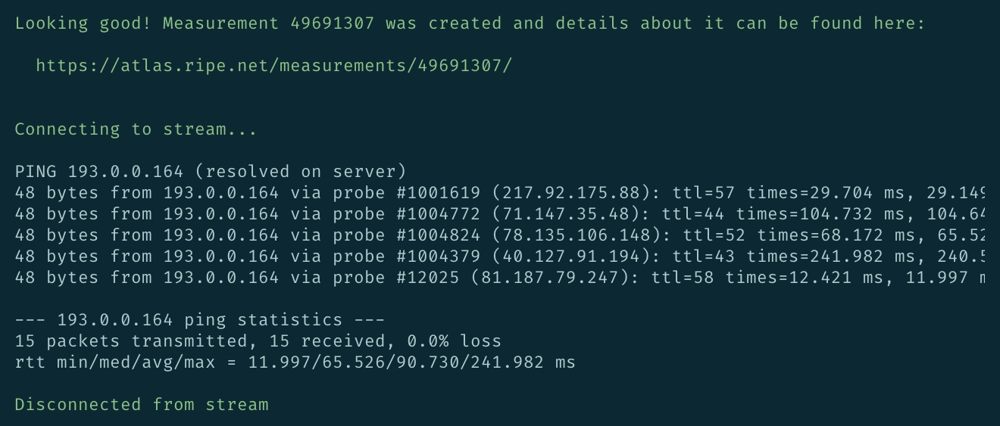
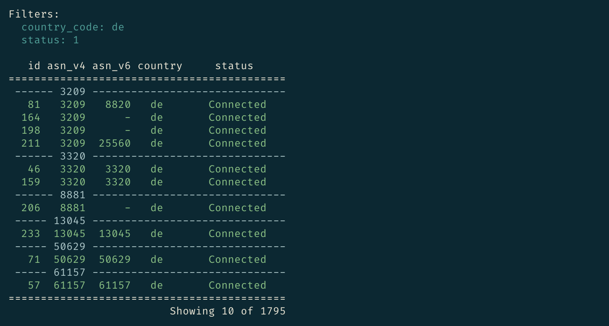
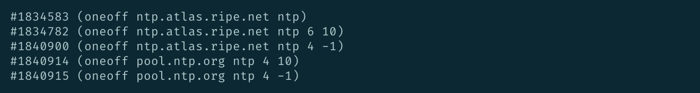

RIPE Atlas Tools (Magellan)
===========================
|Documentation| |Build Status| |PYPI Version| |Python Versions| |Python Implementations| |Python Format| |Requirements|

The official command-line client for RIPE Atlas.

Full Documentation
------------------

Everything is up on `ReadTheDocs`_

Examples
--------
Configure API key for creating measurements::

    $ ripe-atlas configure --set authorisation.create=MY_API_KEY

Ping an IP address from five probes::

    $ ripe-atlas measure ping ping.ripe.net --probes 5

Search for connected probes in Germany, grouping by ASN::

    $ ripe-atlas probe-search --country de --aggregate-by asn_v4 --limit 10

Search for NTP measurement metadata and process the results with awk::

    $ ripe-atlas measurement-search --type ntp --format tab --no-header --limit 5 \
      | awk -Ft '{printf "#%s (%s)\n", $1, $3}'

Can I Contribute?
-----------------

Absolutely.  Please read our `guide`_ on how to contribute.

Colophon
--------

This project was code-named by means of a `poll`_.  In order to conform to the
RIPE Atlas theme, it had to be named for an explorer, and so the winning
suggestion was for Magellan, *"in memory of those times when RTT was ~3 years"*.

.. |Documentation| image:: https://readthedocs.org/projects/ripe-atlas-tools/badge/?version=latest
  :target: http://ripe-atlas-tools.readthedocs.org/en/latest/?badge=latest
  :alt: Documentation Status
.. _ReadTheDocs: https://ripe-atlas-tools.readthedocs.org/
.. _guide: https://github.com/RIPE-NCC/ripe-atlas-tools/blob/master/CONTRIBUTING.rst
.. _poll: https://github.com/RIPE-NCC/ripe-atlas-tools/issues/13
.. |Build Status| image:: https://travis-ci.org/RIPE-NCC/ripe-atlas-tools.png?branch=master
   :target: https://travis-ci.org/RIPE-NCC/ripe-atlas-tools
.. |PYPI Version| image:: https://img.shields.io/pypi/v/ripe.atlas.tools.svg
.. |Python Versions| image:: https://img.shields.io/pypi/pyversions/ripe.atlas.tools.svg
.. |Python Implementations| image:: https://img.shields.io/pypi/implementation/ripe.atlas.tools.svg
.. |Python Format| image:: https://img.shields.io/pypi/format/ripe.atlas.tools.svg
.. |Requirements| image:: https://requires.io/github/RIPE-NCC/ripe-atlas-tools/requirements.svg?branch=master
  :target: https://requires.io/github/RIPE-NCC/ripe-atlas-tools/requirements/?branch=master
  :alt: Requirements Status

