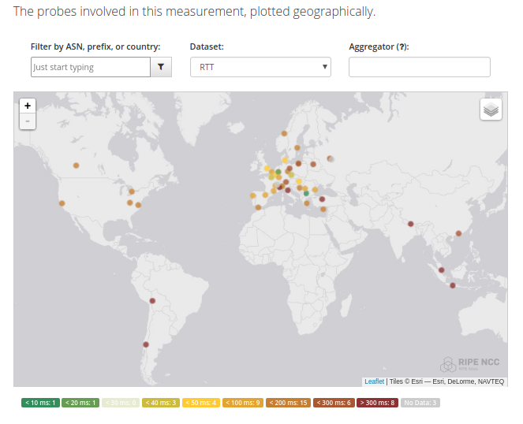

Doing a healthcheck with Atlas Tools
************************************

The RIPE Atlas Tools have lots of features, so the following chapter is about performing a health check on your network from the network of probes to get an idea of the power available.

Feel free to expand this by adding to the :ref:`how-to-contribute`
or discover more options in the chapter
:ref:`complete usage documentation <use>`

The main idea here is to show how you can perform health checking using the tools. Hopefully it will help to get an overview of your network and perhaps discover things that are not working - pinpoint any problems.

The types of measurements available are: dns, ping, traceroute, http, ntp,  sslcert

Check your DNS
==============

A very important thing for services today is the `Domain Name System (DNS)
<https://en.wikipedia.org/wiki/Domain_Name_System>`_.

The first thing you might want to do is to lookup a critical DNS record, by default the A record - name to IP address -

.. code:: bash

    ripe-atlas measure dns --query-argument www.example.com

This should give you a lot of output similar to the one below:

::

    ; <<>> RIPE Atlas Tools <<>> example.com.
    ;; global options: +cmd
    ;; Got answer:
    ;; ->>HEADER<<- opcode: QUERY, status: NOERROR, id: 59280
    ;; flags: qr ra rd; QUERY: 1, ANSWER: 1, AUTHORITY: 0, ADDITIONAL: 0

    ;; QUESTION SECTION:
    ;example.com.                     IN     A

    ;; ANSWER SECTION:
    example.com.             12618    IN     A      192.0.2.10

    ;; Query time: 18.68 msec
    ;; SERVER: 8.8.8.8#53(8.8.8.8)
    ;; WHEN: Sat Jun 23 17:58:33 CEST 2018
    ;; MSG SIZE  rcvd: 44

You will also see links to the Atlas portal where you can see details, similar to this:
https://atlas.ripe.net/measurements/146...02/

This includes a map of the probes

or even download the results in JSON format by adding ?format=json
https://atlas.ripe.net/api/v2/measurements/146...02/results/?format=json

Note: the ID is not correct in these links, so they are not working.

If you see some probes don't get a result maybe its time to investigate

::

  - 3 -

  ; <<>> RIPE Atlas Tools <<>> kramse.org.
  ;; global options: +cmd
  ;; Got answer:
  ;; ->>HEADER<<- opcode: QUERY, status: REFUSED, id: 64677
  ;; flags: qr rd; QUERY: 1, ANSWER: 0, AUTHORITY: 0, ADDITIONAL: 0

  ;; QUESTION SECTION:
  ;example.com.                     IN     NS

  ;; Query time: 2.728 msec
  ;; SERVER: 194.28.32.6#53(194.28.32.6)
  ;; WHEN: Sun Jun 24 10:14:52 CEST 2018
  ;; MSG SIZE  rcvd: 28

If you have more DNS problems checking if the NS records are correct, as seen from the probes might help. This can be done using

.. code:: bash

    ripe-atlas measure dns --query-type ns --query-argument example.com

which should return a consistent view of your DNS servers from all probes:

::

    ;; ANSWER SECTION:
    example.com.            86400    IN     NS     a.iana-servers.net.
    example.com.            86400    IN     NS     b.iana-servers.net.

also recommended to check using TCP - default is UDP.

.. code:: bash

    ripe-atlas measure dns --protocol TCP --query-type NS --query-argument example.com

Check using ping
================

To check reachability using the ping protocol you can start a command that searches for probes and returns the results from probes, like this:

::

    ripe-atlas measure ping --target 192.0.2.123

    Looking good!  Your measurement was created and details about it can be found here:

    https://atlas.ripe.net/measurements/14730226/

    Connecting to stream...

    48 bytes from probe #11521 94.210.154.6    to 192.0.2.123 (192.0.2.123): ttl=241 times:25.486,  27.562,  25.255,
    48 bytes from probe #35083 84.63.103.73    to 192.0.2.123 (192.0.2.123): ttl=244 times:34.742,  34.023,  33.811,
    48 bytes from probe #35339 86.101.110.133  to 192.0.2.123 (192.0.2.123): ttl=242 times:42.0,    43.379,  44.384,
    48 bytes from probe #21863 173.241.172.221 to 192.0.2.123 (192.0.2.123): ttl=238 times:156.316, 156.088, 156.168,
    48 bytes from probe #32763 186.155.151.51  to 192.0.2.123 (192.0.2.123): ttl=243 times:169.998, 201.867, 178.665,
    48 bytes from probe #13926 185.23.196.254  to 192.0.2.123 (192.0.2.123): ttl=241 times:152.17,  151.587, 144.519,
    48 bytes from probe #35283 217.28.163.28   to 192.0.2.123 (192.0.2.123): ttl=240 times:105.232, 106.373, 105.03,
    ...

Check your certificates
=======================

Another common problem is to do with TLS/SSL certificates for HTTPS.

This can be checked using

.. code:: bash

    ripe-atlas measure sslcert --target www.example.com
